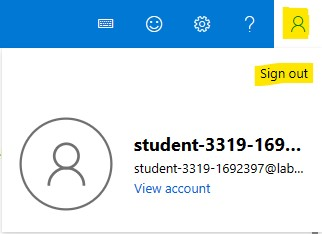

# Using Form Recognizer Studio for document processing

## Form Recognizer Studio

Form Recognizer Studio is an online tool to visually explore, understand, train, and integrate features from the Form Recognizer service into your applications. The studio provides a platform for you to experiment with the different Form Recognizer models and interactively sample their returned data without the need to write code.

## Form Recognizer Studio features

The following Form Recognizer service features are available in the Studio.

* Read: Try out Form Recognizer's Read feature to extract text lines, words, detected languages, and handwritten style if detected. 
* Layout: Try out Form Recognizer's Layout feature to extract text, tables, selection marks, and structure information.
* General Documents: Try out Form Recognizer's General Documents feature to extract key-value pairs and entities. 
* Prebuilt models: Form Recognizer's prebuilt models enable you to add intelligent document processing to your apps and flows without having to train and build your own models
* Custom models: Form Recognizer's custom models enable you to extract fields and values from models trained with your data, tailored to your forms and documents. Create standalone custom models or combine two or more custom models to create a composed model to extract data from multiple form types.

## Prerequisites

* Azure subscription

## Learning objectives

* Create a Form Recognizer resource
* Learn about the different models

## Exercise 1: Create a Form Recognizer resource

1.  Go to the [Azure](https://portal.azure.com) portal and in the homepage, search for _Applied AI services_ in the top search bar. Click _Create_ on the Form Recognizer card.

    

2. Enter the following details under the _Basics_ tab. Rest, keep it as is.

    * Subscription - Select the predefined subscription from dropdown
    * Resource group - Select the predefined Resource group from dropdown
    * Region - Central US 
    * Name - An unique name
    * Pricing tier - Free tier (F0)

    

3. Click _review + create_ and then click _create_. Wait for few minutes for the deployment to complete.

4. Once the deployment is completed, click on **Go to resource** button. It will take you to the Form recognizer resource. Now click on _Try it_ on the Form Recognizer Studio card to use the Studio.

    
    
5. If you are already signed in to a Microsoft account, select the account information in the upper-right corner of the form recognizer studio and click sign out.

    
    
6. Select **signin** in the upper-right corner of the form recognizer studio. You will need to use the credentials provided for you to login to azure portal.

    

    > Note: You may prefer to use an incognito/private mode browser to log in if you want to keep your lab work entirely separate.

7. If presented with the choice to Pick an account, select the account you used for signing into azure portal for this lab.

    

## Exercise 2: Learn about the different models in Form Recognizer Studio

Azure Form Recognizer supports a wide variety of models that enable you to add intelligent document processing to your apps and flows. You can use a prebuilt document analysis or domain specific model or train a custom model tailored to your specific business needs and use cases.

### Model overview

Model  | Description
------------- | -------------
__Document analysis models__
Read OCR  | Extract print and handwritten text including words, locations, and detected languages.
Layout analysis | Extract text and document layout elements like tables, selection marks, titles, section headings, and more.
General document | Extract key-value pairs in addition to text and document structure information.
__Prebuilt models__
W-2	| Process W2 forms to extract employee, employer, wage, and other information.
Invoice | Automate invoice processing for English and Spanish invoices.
Receipt	| Extract receipt data from English receipts.
Identity document (ID) | Extract identity (ID) fields from US driver licenses and international passports.
Business card | Scan business cards to extract key fields and data into your applications.
__Custom models__	
Custom models | Extract data from forms and documents specific to your business. Custom models are trained for your distinct data and use cases.
Composed models | Combine several custom models into a single model to automate processing of diverse document types with a single composed model.

 

### Read OCR

The Read API analyzes and extracts lines, words, their locations, detected languages, and handwritten style if detected.

#### _Sample document processed using the Form Recognizer Studio_:

### Layout analysis

The Layout analysis model analyzes and extracts text, tables, selection marks, and other structure elements like titles, section headings, page headers, page footers, and more.
#### _Sample document processed using the Form Recognizer Studio_:

### General document

The general document model is ideal for extracting common key-value pairs from forms and documents. It’s a pre-trained model and can be directly invoked via the REST API and the SDKs. You can use the general document model as an alternative to training a custom model.

#### _Sample document processed using the Form Recognizer Studio_:

### W-2

The W-2 form model extracts key information reported in each box on a W-2 form. The model supports standard and customized forms from 2018 to the present, including single and multiple forms on one page.

#### _Sample document processed using the Form Recognizer Studio_:

### Invoice

The invoice model automates processing of invoices to extract customer name, billing address, due date, and amount due, line items and other key data. Currently, the model supports English, Spanish, German, French, Italian, Portuguese, and Dutch invoices.

#### _Sample document processed using the Form Recognizer Studio_:

### Receipt

Use the receipt model to scan sales receipts for merchant name, dates, line items, quantities, and totals from printed and handwritten receipts. The version v3.0 also supports single-page hotel receipt processing.

#### _Sample document processed using the Form Recognizer Studio_:

### Identity document (ID)

Use the Identity document (ID) model to process U.S. Driver's Licenses (all 50 states and District of Columbia) and biographical pages from international passports (excluding visa and other travel documents) to extract key fields.

#### _Sample document processed using the Form Recognizer Studio_:

### Business card

Use the business card model to scan and extract key information from business card images.

#### _Sample document processed using the Form Recognizer Studio_:

### Custom models

Custom document models analyze and extract data from forms and documents specific to your business. They are trained to recognize form fields within your distinct content and extract key-value pairs and table data. You only need five examples of the same form type to get started.

### Composed models

A composed model is created by taking a collection of custom models and assigning them to a single model built from your form types. You can assign multiple custom models to a composed model called with a single model ID. You can assign up to 100 trained custom models to a single composed model.
