# Extract data using Prebuilt models

 

## Prebuilt models

Extract data from unique document types using the following prebuilt models:
1. W-2
2. Invoice
3. Receipt
4. Identity document (ID)
5. Business card

## Prerequisites

* Azure subscription
* Form Recognizer resource

## Learning objectives

* Learn and explore the Prebuilt models

## W-2 model

The W-2 form model extracts key information reported in each box on a W-2 form. The model supports standard and customized forms from 2018 to the present, including single and multiple forms on one page.

### What is a W-2 form?

Form W-2, also known as the Wage and Tax Statement, is sent by an employer to each employee and the Internal Revenue Service (IRS) at the end of the year. A W-2 form reports employees' annual wages and the amount of taxes withheld from their paychecks. The IRS also uses W-2 forms to track individuals' tax obligations. The Social Security Administration (SSA) uses the information on this and other forms to compute the Social Security benefits for all workers.

### W-2 model in Form Recognizer Studio

1. In the Form Recognizer Studio, click _Try it out_ on the _W-2_ card to use the model.

    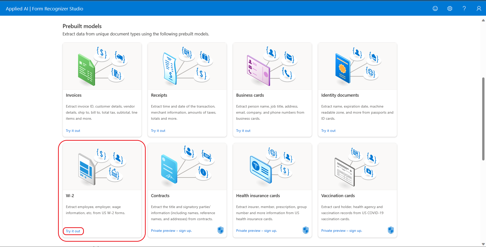

2. Click on the w2-single.png sample and then click on _Analyze_. Upon completion, the result is displayed on the right. The model extracts all the fields in the form. Some fields are grouped together to form a logical entity such as Employer and Employee information. 

    

3. Go to the _Result_ tab to view the JSON output. The output has all the fields along with the _confidence_.

    

## Invoice model

The invoice model automates the processing of invoices to extract customer name, billing address, due date, and amount due, line items and other key data. Invoices can be of various formats and quality including phone-captured images, scanned documents, and digital PDFs.

### Invoice model in Form Recognizer Studio

1. In the Form Recognizer Studio, click _Try it out_ on the _Invoices_ card to use the model.

    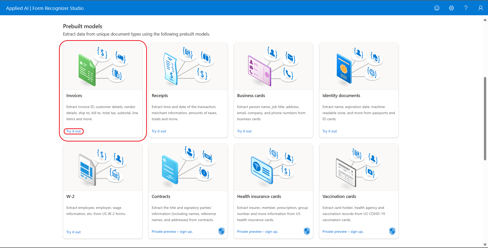

2. Click on the _invoice-english.pdf_ sample and then click on _Analyze_. Upon completion, the result is displayed on the right. The model extracts key-value pairs and tables too. The tables extracted is under the _content_ tab.

    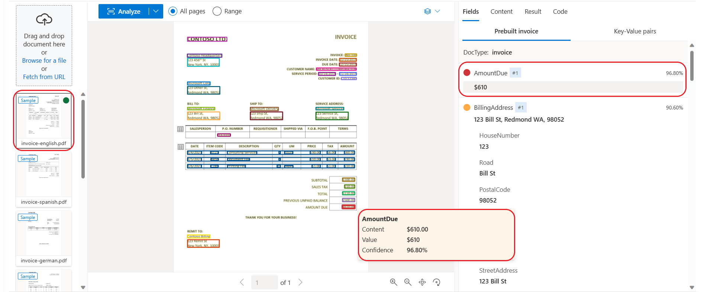

    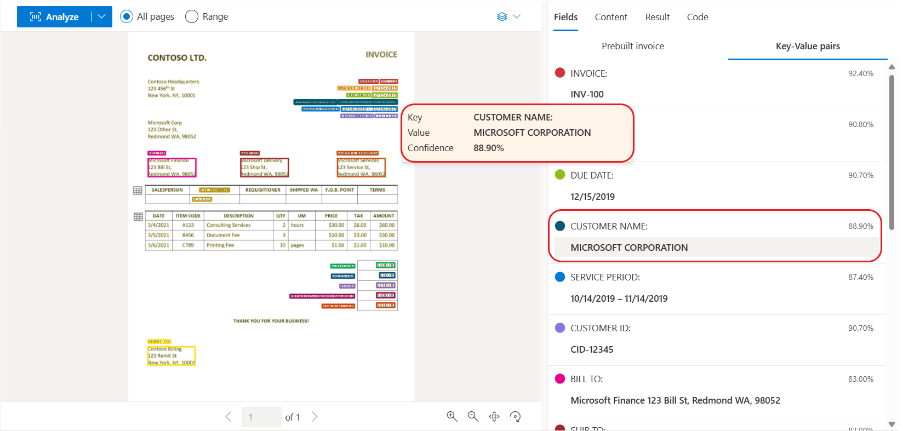

3. Go to the _Result_ tab to view the JSON output. The models outputs words, lines, paragraphs, tables and key-value pairs along with their confidence.

    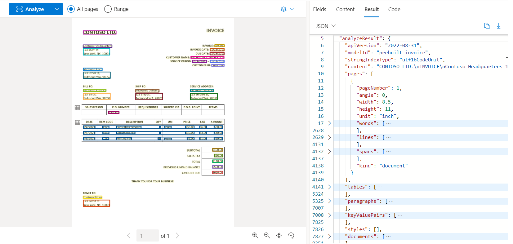

## Receipt model

The receipt model scans sales receipts for merchant name, dates, line items, quantities, and totals from printed and handwritten receipts. Receipts can be of various formats and quality including printed and handwritten receipts.

### Receipt model in Form Recognizer Studio

1. In the Form Recognizer Studio, click _Try it out_ on the _Receipts_ card to use the model.

    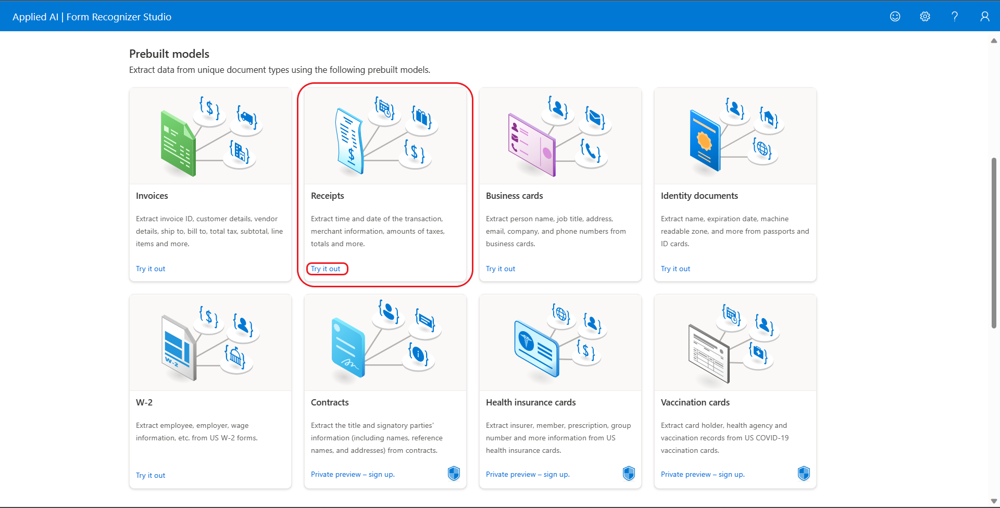

2. Click on the _receipt-with-tips.jpg_ sample and then click on _Analyze_. Upon completion, the result is displayed on the right. The model extracts printed text fields such as _MerchantAddress_, _MerchantName_, _MerchantPhoneNumber_, etc., as well as handwritten text fields such as _Tip_ and _Total_ from the receipt. 

    

3. Go to the _Result_ tab to view the JSON output. 
    
    1. The _Items_ field is extracted as an array of objects. Each object contains sub-fields like _Description_, _Quantity_ and _TotalPrice_. 
    
        

    2. Handwritten areas are identified through _spans_ property under the _styles_ collection. 
    
        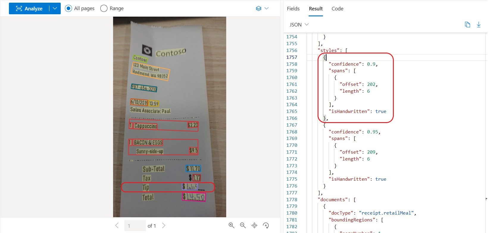
    
    3. The value within the areas is extracted as fields such as _Tip_ and _Total_ under _fields_ property.
    
        

## Identity document (ID) model

The Identity document (ID) model analyzes and extracts key information from identity documents such as US Drivers Licenses (all 50 states and District of Columbia), international passport biographical pages, US state IDs, social security cards, and permanent resident cards and more.

### Identity document (ID) model in Form Recognizer Studio

1. In the Form Recognizer Studio, click _Try it out_ on the _Identity documents_ card to use the model.

    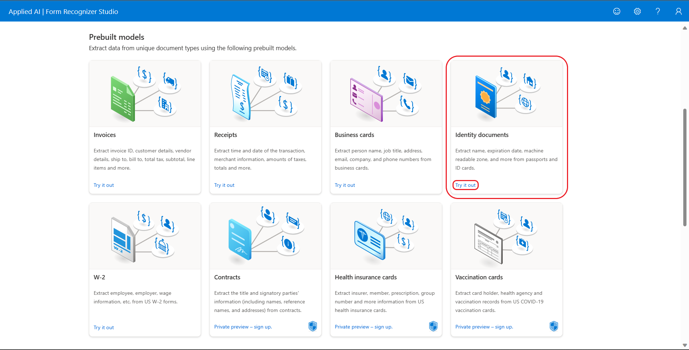

2. Click on the _id-license.png_ sample and then click on _Analyze_. Upon completion, the result is displayed on the right. The model recognizes the document type to be of _idDocument.driverLicense_ and extracts fields specific to the driver license such as _Address_, _CountryRegion_, _DateOfBirth_ and more.

    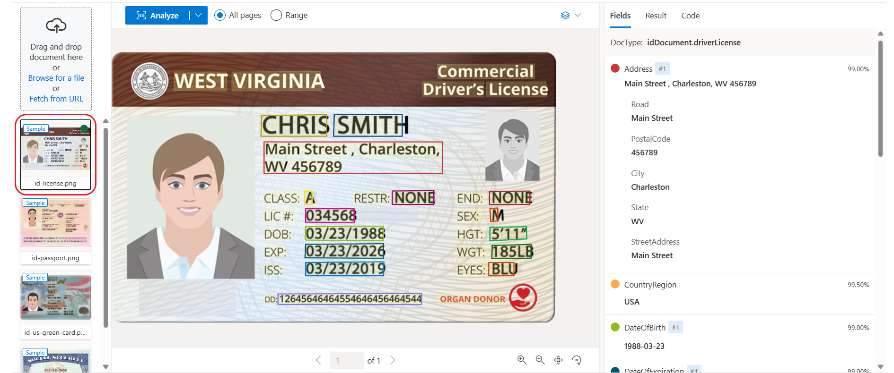

3. Go to the _Result_ tab to view the JSON output. The extracted fields are under the _fields_ property. Each field has its respective _value_, _boundingRegions_, _spans_ and _confidence_.

    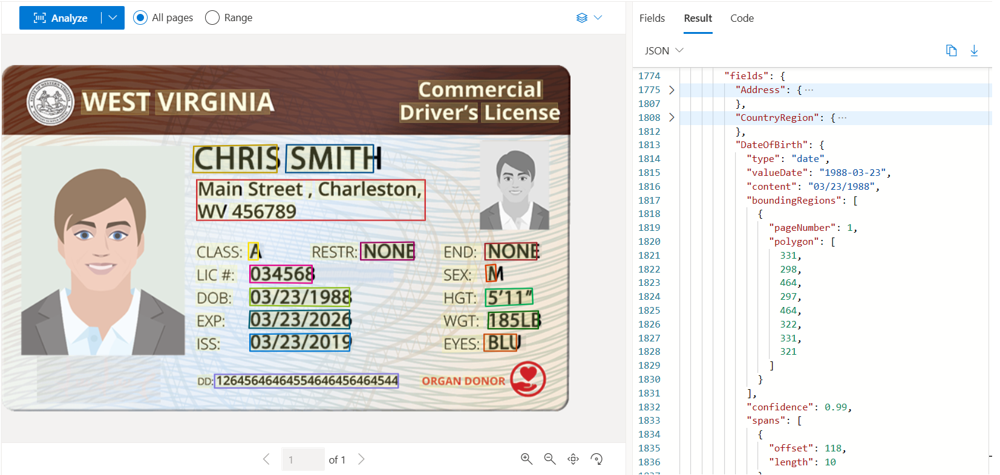

## Business card model

The Business card model analyzes printed business cards and extracts key information such as first name, last name, company name, email address, and phone number from business card images.

### Business card model in Form Recognizer Studio

1. In the Form Recognizer Studio, click _Try it out_ on the _Business cards_ card to use the model.

    

2. Click on the _bizcard.jpg_ sample and then click on _Analyze_. Upon completion, the result is displayed on the right. 

    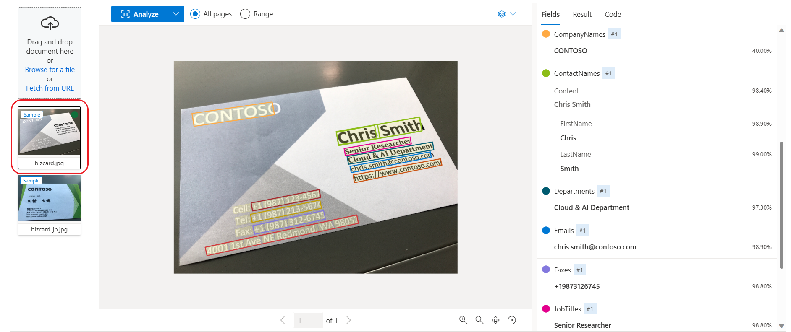

3. Go to the _Result_ tab to view the JSON output. The extracted fields are under the _fields_ property. Each field has its respective _value_, _boundingRegions_, _spans_ and _confidence_.

    
